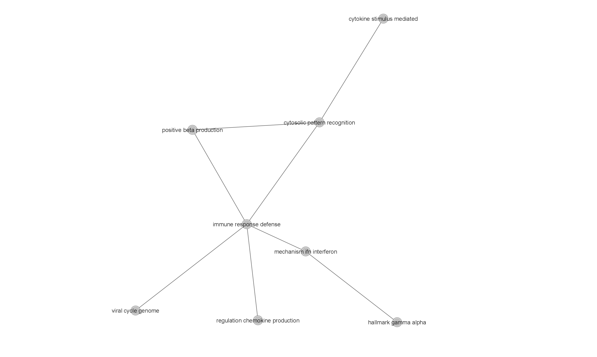

# Preparations
```{r message=FALSE, warning=FALSE, results='hide'}
if (!requireNamespace("ComplexHeatmap", quietly = TRUE))
  BiocManager::install("ComplexHeatmap")
if (!requireNamespace("circlize", quietly = TRUE))
  install.packages("circlize")
if (!requireNamespace("gprofiler2", quietly = TRUE))
  install.packages("gprofiler2")
if (!requireNamespace("BiocManager", quietly = TRUE)) {
  install.packages("BiocManager")
}
if (!requireNamespace("ggplot2", quietly = TRUE)) {
  install.packages("ggplot2")
}
if (!requireNamespace("tibble", quietly = TRUE)) {
  install.packages("tibble")
}
if (!requireNamespace("dplyr", quietly = TRUE)) {
  install.packages("dplyr")
} 
if (!requireNamespace("edgeR", quietly = TRUE)) {
  install.packages("edgeR")
}
if (!requireNamespace("limma", quietly = TRUE)) {
  install.packages("limma")
}
if(!requireNamespace("tidyr", quietly = TRUE)) {
  install.packages("tidyr")
}
if(!requireNamespace("stringr", quietly = TRUE)) {
  install.packages("stringr")
}
if(!requireNamespace("knitr", quietly = TRUE)) {
  install.packages("knitr")
}


```

```{r message=FALSE, warning=FALSE, results='hide'}
suppressPackageStartupMessages({
library("edgeR")
library("circlize")
library("ComplexHeatmap")
library("gprofiler2")
library("ggplot2")
library("tibble")
library("dplyr")
library("stringr")
library("knitr")
})
```
## Introduction: Recap from assignment 1 and assignment 2

In assignment 1, GEO dataset GSE150621 is chosen and it studies Gestational diabetes (GDM)[Exposure to gestational diabetes enriches immune-related pathways in the transcriptome and methylome of human amniocytes](https://doi.org/10.1210/clinem/dgaa466)[@pinney2020exposure], which has profound effects on the intrauterine metabolic milieu and is linked to obesity and diabetes in offspring. A nested case-control study was performed in second trimeseter amniocytes matched for offspring sex, maternal race/ethnicity, maternal age, gestational age at amniocentesis, gestational age at birth and gestational diabetes status. Sex-specific RNA-sequencing was completed and gene expression changes were identified.The data was cleaned, mapped, and normalized using a standard pipeline. In assignment 2, the normalized data from a1 was conducted with differential gene expression analysis and threshold over-representation analysis using [G profiler](https://biit.cs.ut.ee/gprofiler/gost)[@gprofiler2]. It was found that the top-enriched genesets are involved in the regulation of viral process, Interferon alpha/beta signaling, and Type I interferon induction and signaling during SARS-CoV-2 infection. 

### Load the data
```{r}
# Read the normalized counts of GSE150621 into a table
data<-read.table("./GSE150621_finalized_normalized_counts.txt") 
head(data)
```

### Create the samples' groups
```{r}
samples <- data.frame(
  lapply(colnames(data)[3:16],
         FUN=function(x){
           unlist(strsplit(x, split = "_"))[3]})) 

samples=as.data.frame(t(samples))

samples[which(samples[,1]=="CF"|samples[,1]=="CM"),2]="Control" 
samples[which(samples[,1]=="DF"|samples[,1]=="DM"),2]="Case" 
samples[which(samples[,1]=="CF"|samples[,1]=="DF"),3]="Female"
samples[which(samples[,1]=="CM"|samples[,1]=="DM"),3]="Male" 
colnames(samples)=c("label","Group","Gender")
row.names(samples)=colnames(data)[3:16]

model_design <- model.matrix(~ samples$Group )

expressionMatrix <- as.matrix(data[,3:16])
rownames(expressionMatrix) <-data$refGene
colnames(expressionMatrix) <-colnames(data)[3:16]
```

### Use the EdgeR method to demonstrate the top-hits.
```{r}
d = DGEList(counts=expressionMatrix, group=samples$Group)

model_design_gender <- model.matrix(~samples$Gender+samples$Group)

d <- estimateDisp(d, model_design_gender)

fit <- glmQLFit(d, model_design_gender)

qlf.pos_vs_neg <- glmQLFTest(fit,coef = "samples$GroupControl")
kable(topTags(qlf.pos_vs_neg), type="html",row.names = FALSE)

qlf_output_hits <- topTags(qlf.pos_vs_neg,sort.by = "PValue",
                           adjust.method = "BH",
                           n = nrow(data))

```

### Export the ranked top hits.
```{r}
qlf_output_hits_withgn <- merge(data[,1:2],qlf_output_hits, by.x=1, by.y = 0)
qlf_output_hits_withgn[,"rank"] <- -log(qlf_output_hits_withgn$PValue,base =10) * sign(qlf_output_hits_withgn$logFC)
qlf_output_hits_withgn <- qlf_output_hits_withgn[order(qlf_output_hits_withgn$rank),]
qlf_output_hits_withgn <- qlf_output_hits_withgn[, c("HGNC_genes", "rank")]
write.table(x=data.frame(genename= qlf_output_hits_withgn$HGNC_genes,F_stat= qlf_output_hits_withgn$rank),
            file="ranked.rnk",sep = "\t",
            row.names = FALSE,col.names = FALSE,quote = FALSE)
```

# Non-thresholded Gene set Enrichment Analysis

<br/>
**Question 1: What method did you use? What genesets did you use? Make sure to specify versions and cite your methods.** <br/> 
I used [GSEA (version 4.3.2)](https://www.gsea-msigdb.org/gsea/index.jsp)[@subramanian2007gsea] for my non-thresholded gene set enrichment analysis. I used the genesets from Bader's lab (https://download.baderlab.org/EM_Genesets/current_release/Human/symbol/), and I selected the latest file with GOBP and all pathways "Human_GOBP_AllPathways_no_GO_iea_March_02_2023_symbol.gmt". In GSEA, I firstly loaded two files: the geneset database from Bader's lab and the ranks.rnk file, which was generated in the aboved step. Then I ran GSEA using the parameters of 
* Number of permutation: 1000
* Max size: 500
* Min size: 15
<br/>


**Question 2: Summarize your enrichment results.** <br/> 
For upregulated genes, there are:
* 1135 / 5624 gene sets.
* 366 gene sets are significantly enriched at nominal pvalue < 5%

For downregulated genes, there are:
* 4489 / 5624 gene sets.
* 1035 gene sets are significantly enriched at nominal pvalue < 5%
<br/>

**Question 3: How do these results compare to the results from the thresholded analysis in Assignment #2. Compare qualitatively. Is this a straight forward comparison? Why or why not?** <br/>
The down-regulated genesets are similar to assignment 2's result, focusing on the immune response. However, there are many up-regulated protein synthesis which did not occur in the results of A2. This is a straight forward comparision because the top 20 up-regulated pathways are all made up with different kinds of protein, while the ones in A2 focus on other different ones. 

# Visualize Gene set Enrichment Analysis in Cytoscape

<br>
**Question 1: Create an enrichment map - how many nodes and how many edges in the resulting map? What thresholds were used to create this map? Make sure to record all thresholds. Include a screenshot of your network prior to manual layout.** <br/>

In [Cytoscape](https://cytoscape.org/)[@shannon2003cytoscape], I used the enrichmentMap app[@isserlin2014enrichment] 147 nodes and 721 edges were generated in the resulting map. The default threshold for node cutoff of Q-value of 0.01, and edge cutoff of 0.375. The blue nodes are the downreguated genesets and the red nodes are the upregulated genesets. 

The below is an overviewed of the whole network.


<br/>
**Figure 1:** The basic overview of the geneset pathways generating by the default threshold.
<br/>
<br/>


<br/>
**Figure 2:** The most interconnected focus of the geneset pathways generating by the default threshold.
<br/>
<br/>

<br>
**Question 2: Annotate your network - what parameters did you use to annotate the network. If you are using the default parameters make sure to list them as well.** <br/>
I annotated useing the AutoAnnotate app[@kucera2016autoannotate], and the default parameters with the size of the node corresponding to the size of the geneset, colour of node corresponds to the phenotype and the p-value, label of the node corresponds to the geneset description, and thickness of the edge corresponds to overlap statistic. The more genes two nodes have in common the thicker the edge.

The following figure is the output generated:

<br/>
**Figure 3:** The annotated gene pathways generated using the AutoAnnotate app.
<br/>
<br/>

<br>
**Question 3: Make a publication ready figure - include this figure with proper legends in your notebook.** <br/>

The following figure is the publication-ready figure:

<br/>
**Figure 4:** The publication ready figure of the genesets. 
<br/>
<br/>


<br/>
**Figure 5:** The legends for figure 4. 
<br/>
<br/>

<br>
**Question 4: Collapse your network to a theme network. What are the major themes present in this analysis? Do they fit with the model? Are there any novel pathways or themes?** <br/>
The major theme of the pathway is focued on the immune system defense, which is shown as below. The results fit with the model, and the theme is similar to the original paper's conclusion. 




<br/>
**Figure 6:** The collapsed and themed network for my GSEA geneset. 
<br/>
<br/>

# Intepretations
1. Do the enrichment results support conclusions or mechanism discussed in the original paper? How do these results differ from the results you got from Assignment #2 thresholded methods?
Yes, in the original paper, it shows that the strong enrichment of inflammation and immune response pathways was present in all 3 analyses of GDM-exposed amniocytes, and the enrichment results support this. 
In assignment 2, the most enriched pathways in the threshold analysis are:
<br/>
GO:BP: 3721, with negative regulation of viral process (16)
reactome: 623, with  Interferon alpha/beta signaling(17)   
WikiPathways: 359, with Type I interferon induction and signaling during SARS-CoV-2 infection(10).
All these could be found in the GSEA enrichment results. However, there are some up-regulated pathways the GSEA results that did not occur in the A2 thresholded method. These are the pathways of 19 protein synthesis placed in the top-enriched rank of the up-regulated pathways from the GSEA results. 

2. Can you find evidence, i.e. publications, to support some of the results that you see. How does this evidence support your result?
I did not find any external publications which could explain why there are so many up-regulated protein synthesis. But from the original paper discovered that many top expressed genes are interferon proteins, and it might indirectly lead to many different protein synthesis. 


3. Choose a specific pathway or theme to investigate in more detail. Why did you choose this pathway or theme? Show the pathway or theme as a gene network or as a pathway diagram. Annotate the network or pathway with your original log fold expression values and p-values to show how it is effected in your model.

I chosed the pathway of interferon signalling because it is important to the paper as it found expression of interferon-stimulated genes was increased in GDM amniocytes. I generated it as a gene network using STRING[@doncheva2018cytoscape], as shown below:


<br/>
**Figure 7:** The network of interferon signaling. 
<br/>
<br/>


# References
